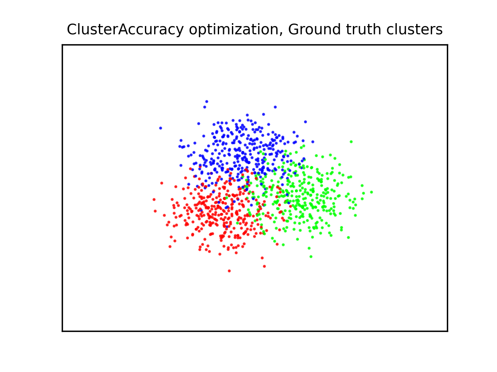
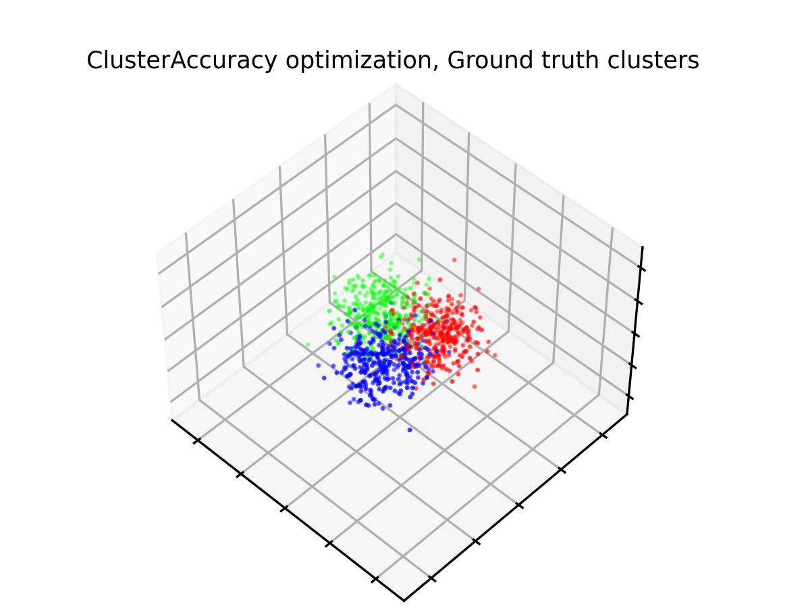
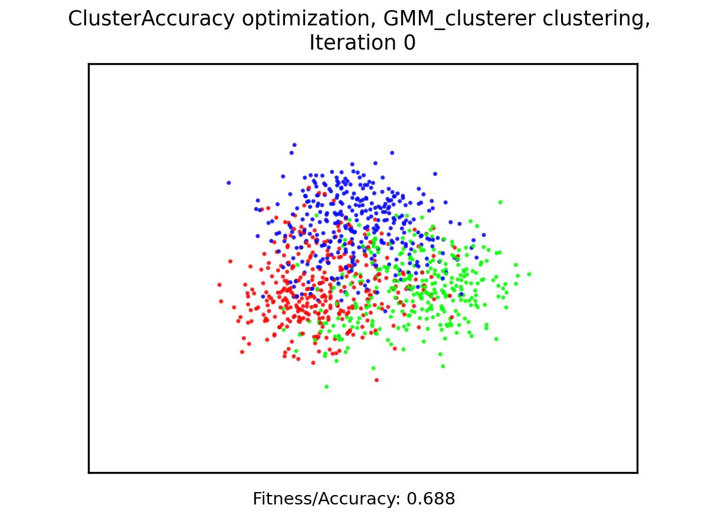
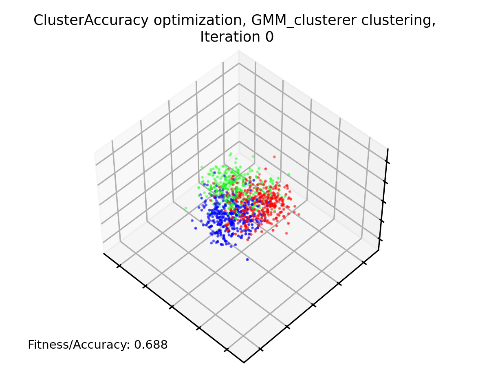
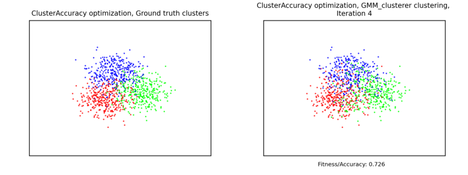
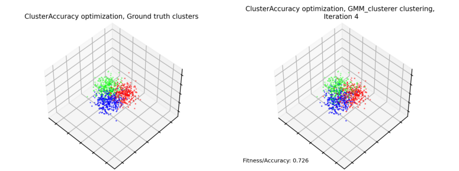

This library provides a vanilla implementation of a [genetic algorithm](https://en.wikipedia.org/wiki/Genetic_algorithm), currently supporting only the optimization of binary strings (so in order to use it you'll have to find a way to translate the binary string in the actual solution to your problem).

#### Toy problems
Two toy problems are provided:

- **OneMax** optimization: the *goal* of this problem is to obtain a binary string of only *1*s, starting from a random binary string. Despite the apparent triviality of this task, this has to be achieved through ***random mutations*** of the initial "*population*" of strings.

- **Unsupervised feature selection for clustering** in high-dimensional spaces: given a *high-dimensional dataset*, an **evolutionary approach** can be used to determine which data fields are useful for the **unsupervised classification** of samples. 
This is especially useful if we have little to no knowledge about *semantics* behind the data fields (the various *dimensions* of each data point) and their relative importance in the *clustering* of each sample (their classification into groups).

#### Modules
The library is highly modularized and extensible (feel free to fork this project), into the following modules:

- `optimization`: provides the `GenericBinaryOptimizer` class, that wraps the ***genetic algorithm*** itself, with the following methods:
    - `learn`: given the parameter `n_iterations`, performs said number of iterations of the genetic algorithm (unless the `early_stopping` is triggered). The tipycal learning process consists of the following steps:
        1. Generate the initial population of size `population_size`
        2. Compute fitness for all individuals of initial population using the specified fitness function
        
        3. Loop for `n_iterations` or until the `early_stopping` is triggered:
            1. Select `population_size` parents
            2. Draw `population_size/2` parents pairs
            3. Generate two children from each pair using the specified `crossover` method
            4. Perform random mutations on the population using the chosen `mutation` method
            5. Compute the `fitness` value for each element
            6. If there was an improvement visualize it using the chosen `visualization` methods
            7. If required, save a snapshot
            8. If the `early_stopping` conditions are met, break the iterative process
    - `save_snapshot`: saves a snapshot of the current state of the optimization process (so that it can be resumed later)
    - `load`: loads a previously saved snapshot and returns its instance
<br/>

- `population_initializer`: used initialize a population to be optimized by the evolutionary learner 
    - abstract class `PopulationInitializer` used by the `optimizer` module
        - `BinaryPopulationInitializer`: an example of initializer for a population of binary strings.
<br/>

- `crossover`: functions that perform the "*reproductive step*" of the evolutionary process, by producing several individuals of the population from parents selected from the previous one
    - abstract class `CrossoverMethod` for the typical implementation of a *crossover function*
        - `RandomSplit`: an example of a crossover method that, given two parents, generates two children that either identical to the parents or (with a certain *probability*) selecting a random point in the parents and swapping each the second half of the first parent with the second half of the second parent, e.g.:

            ```
            Parent 1: 11010010
            Parent 2: 10100101

            1) A random point is selected in the parents:

                Parent 1: 110|10010
                Parent 2: 101|00101

            2) Children are obtained by mixing the second halves of the parents:

                Child 1: 110|00101
                Child 2: 101|10010
            ```
<br/>

- `mutation`: functions that perform the *mutation step* of the evolutionary optimization loop, that applies small random changes to each individual of the population to ensure avoidance of local minima/maxima of the *objective function* and ensures further exploration of the solution space:
    - abstract class `MutationMethod` for the typical implementation of a *mutation function*
        - `RandomBitFlip`: given a binary individual, flips each bit with a certain probability
<br/>

- `fitness_evaluation`: selection of functions that compute the fitness ("*quality*") of each populatuion individual, that can be considered as an ***objective function*** for the optimization problem:

    - abstract class `FitnessEvaluationMethod`, typical fitness function wrapper used by the optimizer class 
        <br />
        
        - `OneMax`: fitness function for the *OneMax* problem, which just counts the number of *1*s in the string (the higher, the better the quality of the individual)
        
        <br />

        - `ClusterAccuracy`: it makes sense to use this objective function *only in case we have access to the ground truth labels for the clustering problem at hand*. It just computes the accuracy after the data points have been clustered using the given subset of dataset dimensions (selected based on the *1*s in the binary string)

        <br/>

        - `ClusterCentroidDistance`: without ground truth labels, bases the fitness values of the currently selected subset of data fields on the separation (euclidean distance) of the centroids computed for the clusters obtained by the clustering process, so as to increase the separation of clusters in "confusionary"
        - `ClusterMinimumPointDistance`: without ground truth labels, the fitness value is computed on the minimum distance between points of the different clusters, so as to increase the overall separation of clusters in not too "confusionary" datasets
        - `ClusterAveragePointDistanceFromCentroid`: without ground truth labels, bases the fitness values of the currently selected subset of data fields on the average of the distances of each point from its clusters centroid, so as to increase the concentration of data points towards their clusters centroids
        <br/>
    NOTICE: the choice of the fitness function can be handled in two ways:
        - As a hyperparameter (using any hyperparameter tuning policy)
        - Using knowledge about the problem at hand
    <br />

- `visualization`: selection of modules to visualize results of the optimization process
    - abstract class `VisualizationMethod`
        - `Print`: just prints the solution (used in the *OneMax* problem)
        <br/>

        - abstract class `ClusterVisualizer` providing the capability to initialize a visualization method for the clustering problem and to generate a GIF to show the evolutionary progress of this problem
            - `Cluster2DVisualizer`: generates a 2D projection (performed through PCA) of the clustered dataset (each cluster is represented with a color)
            - `Cluster3DVisualizer`: generates a 3D projection (performed through PCA) of the clustered dataset
            - `Cluster2D3DVisualizer`: wraps and executes both above methods
            
            <br/>

            NOTICE: the clustering and optimization happens in a higher-dimensional space, where the dimensions are selected by the optimization process, while the visualization happens on the original dataset (appropriately projected through PCA)
<br/>

- `early_stopping`: provides methods to stop the iterative process earlier if certain conditions are met:
    - abstract class `EarlyStoppingCriterion` providing a typical implementation for an *early stopping* criterion to be used by the optimizer
        - `ImprovementHistoryWithPatience`: given the parameter `patience`, stops the optimization process if there are no improvements after `patience` turns
<br/>

- `clustering`: only useful in the clustering toy problem, contains a selection of clustering methods:
    - abstract class `Clusterer` wrapping the clustering method
        - `KMeans_clusterer`: performs clustering using the K-Means algorithm on data points with the subset of data fields selected with the provided population individual
        - `GMM_clusterer`: performs clustering using the GMM algorithm on data points with the subset of data fields selected with the provided population individual
        - `Spectral_clusterer`: performs clustering using the Spectral clustering algorithm (which also introduces a non-linearity in the clustering process, allowing for concentric clusters) on data points with the subset of data fields selected with the provided population individual
<br/>

- `dataset`: contains the `Dataset` class, used in the clustering problem, that allows generating a high-dimensional *blob dataset* (generated by mixing a certain number of gaussian distributions of data points). The `Dataset` class has the following methods:
    - `generate_blob_dataset`: given the parameters `n_samples`, `n_fields`, `n_clusters`, generates a *blob dataset* by mixing `n_clusters` gaussian distributions of `n_fields`-dimensional data points, with a total number of `n_samples` data points. By specifying a valid directory as the `save_to` parameter, the dataset can be exported as a *.csv* file
    - `load_blob_dataset` that restores a saved dataset given the *.csv* file directory
    - `samples_to_numpy_array` given a N-dimensional binary string, where N is the dimensionality of each data point, returns a 2D numpy array from all data points in the dataset where each data point only has those dimensions that were selected by a *1* in the binary string

#### Use case: *Unsupervised feature selection for clustering*

A possible use case for this library is provided in the `ClusteringExample.py` file. In particular, let's focus on the following bits of code:

First of all we load or generate the dataset
```
    if DATASET_FILENAME is not None:
        #If a dataset file name is specified, load it and return an instance of that dataset
        dataset, ground_truth_cluster_labels, \
        N_SAMPLES, N_DIMENSIONS, N_CLUSTERS = Dataset.load_blob_dataset(DATASET_FILENAME, show = False)
    else:
        #Otherwise generate a dataset using some custom parameters as N_CLUSTERS gaussian distributions of data points
        
        #Total number of samples in the dataset
        N_SAMPLES = 1000 
        #Dimensionality of each dataset sample
        N_DIMENSIONS = 250    
        #Number of clusters in the dataset
        N_CLUSTERS = 3
        #"Hypercube" (of dimensionality N_DIMENSIONS) where all cluster centroids should be contained
        CLUSTERS_CENTERS_RANGE = (-1.5,1.5)
        #Variance of each "blob" of data points
        CLUSTERS_STD_DEV = 6
        
        dataset, ground_truth_cluster_labels = Dataset.generate_blob_dataset(N_SAMPLES, N_DIMENSIONS,       N_CLUSTERS, 
            save_to = os.path.join(DATASET_DIR,"GeneratedBlobDataset.csv"), 
            clusters_centers_range=CLUSTERS_CENTERS_RANGE, std_dev=CLUSTERS_STD_DEV
        )

```
The generated dataset will look something like this:
- In 2D:

- In 3D:


Then we instantiate a clustering algorithm (in this case we're going to use a Gaussian Mixture Model):
```
clusterer = GMM_clusterer(
        dataset, 
        N_CLUSTERS,
        normalize_data=NORMALIZE,
        use_random_seed=True
    )
```
Now we instantiate a fitness function (our objective function), that will also use the clusterer instiantiated at the previous step
```
fitness_function = ClusterAccuracy(
    clusterer,
    ground_truth_cluster_labels
)
```
In this particular case our fitness function also uses the ground truth cluster assignments to compute accuracy of the resulting clustering.

Then we instantiate the visualization method. Also this one needs to use the same clusterer:
```
visualizer_method = Cluster2D3DVisualizer(
    clusterer, 
    show=False, 
    save_snapshot_images_to=SAVE_IMAGES_TO_DIR,
    scale_range=SCALE_RANGE
)
```
Now we instantiate the optimizer method:
```
    genetic_learner = GeneticBinaryOptimizer(
        BinaryPopulationInitializer(POPULATION_SIZE, N_DIMENSIONS),
        fitness_function,
        RandomSplit(CROSSOVER_PROBABILITY),
        RandomBitFlip(MUTATION_PROBABILITY),
        early_stopping_criterion=ImprovementHistoryWithPatience(EARLY_STOPPING_PATIENCE),
        result_visualization_method=visualizer_method,
        n_parent_candidates=min(TOURNAMENT_SELECTION_CANDIDATES, POPULATION_SIZE-1),
        checkpoints_dir=SAVE_CHECKPOINTS_TO_DIR
    )
```
Finally we launch the learning process and make sure that visualizations of the progress are generated after the learning has terminated:
```
    genetic_learner.learn(N_ITERATIONS)
    
    genetic_learner.result_visualization.generate_gif()
```
This is the final result of our clustering process:
- The GIF animation of the various improvements over time:
    - In 2D:
    
    - In 3D:
    
- A comparison between the ground truth clusters and the clustering obtained at the end of the optimization process:
    - In 2D:
    
    - In 3D:
    

#### Use case: *OneMax problem*

The `OneMax` problem is instead the problem of evolutionarily optimizing a random binary string to obtain a string of only *1*s. An example of this problem can be found in the file `OneMaxExample.py`.
